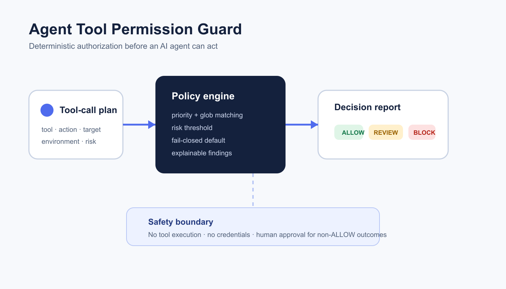

# Agent Tool Permission Guard

Agent Tool Permission Guard is a deterministic authorization layer for proposed AI-agent tool calls. It evaluates a plan against version-controlled policy and returns an explainable `ALLOW`, `REVIEW`, or `BLOCK` decision before any tool can run.



## Why this exists

AI agents can move from answering questions to changing cloud resources, opening tickets, rotating keys, or deploying software. Prompt-level instructions are not a sufficient authorization boundary. This project turns tool, action, environment, resource, and risk context into explicit release evidence.

## What it checks

- deterministic priority-based policy matching;
- tool, action, environment, and resource glob patterns;
- per-rule risk thresholds;
- approval requirements that upgrade `ALLOW` to `REVIEW`;
- restrictive tie-breaking and a fail-closed default;
- duplicate identifiers and malformed input.

The evaluator never calls an LLM, executes a tool, uses credentials, or mutates infrastructure.

## Run locally

```bash
PYTHONPATH=src python -m unittest discover -s tests -v
PYTHONPATH=src python -m agent_tool_permission_guard examples/tool-call-plan.json
```

The sample deliberately includes a production observation and a destructive action, so the command returns a non-zero exit code with a `BLOCK` report.

## Docker

```bash
docker build -t agent-tool-permission-guard .
docker run --rm -v "$PWD/examples:/plans:ro" agent-tool-permission-guard /plans/tool-call-plan.json
```

## n8n integration

`n8n/permission-gate-workflow.json` is inactive by design. It accepts a proposed plan, runs the local evaluator, and routes only `ALLOW` to the authorized response. Every other result stops for human review. Inspect the Execute Command node before importing it into a controlled self-hosted environment.

## Safe deployment pattern

1. Keep policy and synthetic test fixtures in version control.
2. Place this gate before—not inside—the tool executor.
3. Derive risk and environment from trusted server-side context.
4. Protect policy changes with code review and CI.
5. Require human approval for production or destructive actions.
6. Log decisions without storing secrets or sensitive payloads.

## Repository structure

```text
src/       deterministic policy engine and CLI
tests/     unit tests for matching, priority, risk, and failure modes
examples/  synthetic policy and proposed tool-call plan
n8n/       inactive approval-first workflow
docs/      architecture visual
social/    Medium, LinkedIn, and learning notes
```

## Interview positioning

This project demonstrates AI orchestration, policy-as-code, least privilege, deterministic testing, CI/CD, n8n integration, security guardrails, and human-in-the-loop operations without claiming that a prompt alone can secure an agent.

